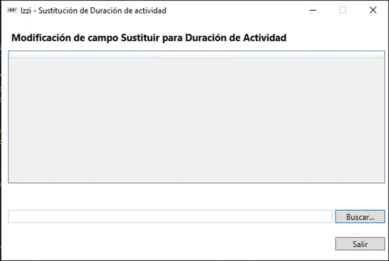
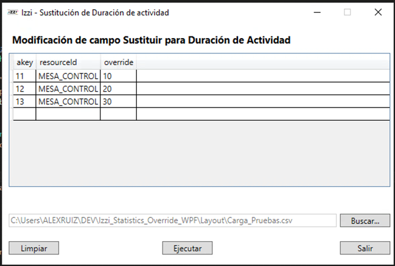
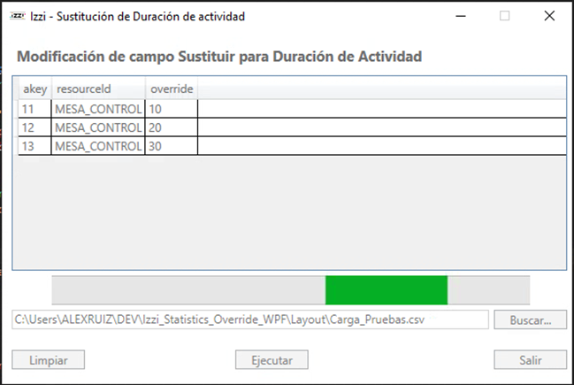
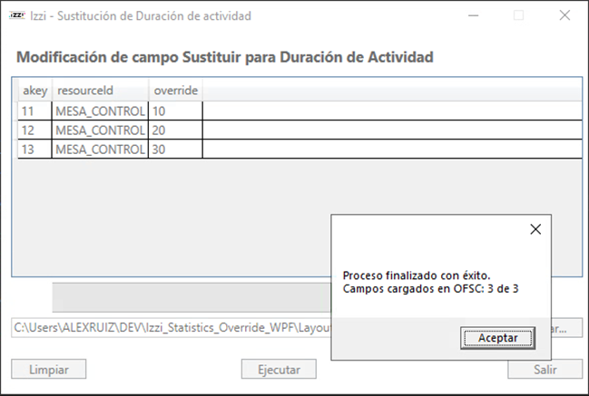

# FTOPS0305241300 Modificación campo Sustituir para cálculo estadísticas

## Descripción

Programa para modificar el campo Sustituir (Override) de la API de Estadísticas de OFSC.

## Requisitos

- .NET Framework 4.6
- Visual C# 2015

## Librerías

Se requieren los siguientes paquétes NuGet para el correcto funcionamiento del programa.

| Librería                               |  Versión |
| -------------------------------------- | -------: |
| Newtonsoft.Json                        |   13.0.3 |
| Newtonsoft.Json.Bson                   |    1.0.2 |
| RestSharp                              | 106.15.0 |
| Microsoft.AspNet.WebApi.Client         |    6.0.0 |
| System.Buffers                         |    4.5.1 |
| System.Memory                          |    4.5.5 |
| System.Runtime.CompilerServices.Unsafe |    4.7.1 |
| System.Threading.Tasks.Extensions      |    4.5.4 |

## Instalación

1. Clonar este repositorio.
2. En la carpeta publish se encuentra el instalador.
3. Ejecutar el archivo de configuración.
4. Ejecutar el archivo .exe

## Uso

1. Seleccionar el archivo layout (XLSX) con el botón Buscar...
   
2. Se mostrará en la aplicación el contenido del archivo layout.
   
3. Presioanr el botón Ejecutar para iniciar el proceso, la aplicación se bloqueará mostrando una barra de carga hasta finalizar el proceso de modificación de campos.
   

   - En caso de que algún campo en la columna "override" esté vacío, se sustituirá por un 0.

4. Una vez que finalice el proceso, se mostrará un mensaje con el resultado.
   

Para reiniciar el proceso, se puede dar clic en el botón Limpiar.

## Contribución

1. Clonar este repositorio.
2. Abrir la solución en Visual Studio.
3. Hacer Build de la solución para descargar los Nuget Packages.
4. Realizar contribuciones al código.
5. Sincronizar los cambios en el repositorio.

## Licencia

Licencia de software.
